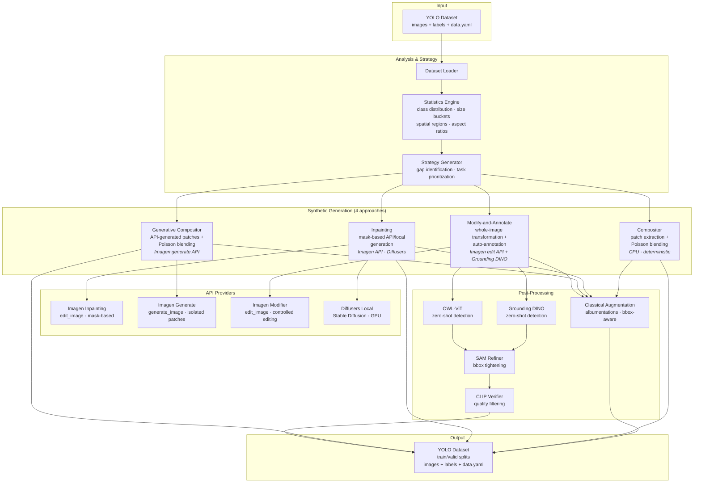

# SynthDet

Synthetic data generation for object detection datasets (YOLO format).

SynthDet automates the creation of synthetic training data for object detection models. The primary use case is augmenting a laptop defect detection dataset (scratches, stains, broken bezels) for YOLO-based automated grading in refurbishment workshops. The library generalizes to any object detection task.

---

## Introduction

SynthDet is a modular pipeline that bridges the gap between small, imbalanced defect datasets and the volume needed to train robust YOLO detectors. It analyzes an existing YOLO dataset, identifies statistical gaps (underrepresented classes, size buckets, spatial regions, aspect ratios), and generates targeted synthetic images to fill those gaps using four complementary approaches.

### Library overview

| Module | Purpose |
|--------|---------|
| **Analysis** (`synthdet.analysis`) | Load YOLO datasets, compute statistics, identify gaps, generate prioritized synthesis strategies |
| **Compositor** (`synthdet.generate.compositor`) | Extract real defect patches and Poisson-blend them onto clean backgrounds — deterministic, no API needed |
| **Inpainting** (`synthdet.generate.inpainting`) | Mask-based generation via Imagen API or local Stable Diffusion — fills masked regions with defects |
| **Generative Compositor** (`synthdet.generate.generative_compositor`) | API-generated isolated defect patches + Poisson blending — avoids the inpainting conflict |
| **Modify-and-Annotate** (`synthdet.generate.modify_annotate`) | Whole-image transformation via Imagen controlled editing + auto-annotation — holistic defect integration |
| **Augmentation** (`synthdet.augment`) | Classical bbox-aware transforms (flips, noise, blur, color jitter) via albumentations |
| **Auto-Annotation** (`synthdet.annotate`) | Zero-shot detection (Grounding DINO / OWL-ViT) + SAM refinement + CLIP verification |
| **Utilities** (`synthdet.utils`) | Bbox format conversions, image I/O, rate limiting |

### Architecture



### How the four generation approaches compare

| Approach | How it works | Annotations | Strengths | Limitations |
|----------|-------------|-------------|-----------|-------------|
| **Compositor** | Extract real patches, Poisson-blend onto clean backgrounds | Perfect (placement known) | Deterministic, free, fast | Limited to existing defect variety |
| **Inpainting** | Mask a region, ask API to fill with defect | From mask (placement known) | New defect variety | Model tends to reconstruct clean surface |
| **Generative Compositor** | API generates isolated patch on gray background, Poisson-blend onto target | Perfect (placement known) | New variety + clean blending | Subtle blending artifacts possible |
| **Modify-and-Annotate** | API transforms entire clean image into damaged version, annotator detects defects | Auto-detected (Grounding DINO / OWL-ViT) | Most realistic integration | Annotations depend on detector quality |

---

## Installation

```bash
# Core (analysis, compositor, augmentation)
pip install -e .

# With annotation support (Grounding DINO, OWL-ViT, SAM, CLIP)
pip install -e ".[annotation]"

# With API-based inpainting (Google Imagen 3)
pip install -e ".[api]"

# With local diffusion inpainting
pip install -e ".[generation]"

# Everything
pip install -e ".[all]"
```

PyTorch must be installed separately following [pytorch.org](https://pytorch.org/) instructions for your platform.

## Quick Start

```bash
# Analyze your dataset
uv run python -m synthdet.analysis data/data.yaml

# Generate synthetic data with compositing
uv run python -m synthdet.generate data/data.yaml --output output/ --seed 42

# Generate with augmentation
uv run python -m synthdet.generate data/data.yaml --output output/ --seed 42 --augment

# Preview inpainting cost without API calls
uv run python -m synthdet.generate data/data.yaml --output output/ --method inpainting --dry-run

# Generate with API-based inpainting
GOOGLE_API_KEY=... uv run python -m synthdet.generate data/data.yaml --output output/ --method inpainting --seed 42

# Use both methods together
uv run python -m synthdet.generate data/data.yaml --output output/ --method both --seed 42
```

---

## Modules

### Analysis (`synthdet.analysis`)

Dataset analysis, statistics computation, and synthesis strategy generation.

#### CLI

```bash
# Rich formatted report
uv run python -m synthdet.analysis data/data.yaml

# Machine-readable JSON
uv run python -m synthdet.analysis data/data.yaml --json

# With custom config
uv run python -m synthdet.analysis data/data.yaml --config configs/laptop_scratch.yaml

# With model evaluation feedback (active learning)
uv run python -m synthdet.analysis data/data.yaml --model-eval eval_results.json
```

**Flags:**

| Flag | Description |
|---|---|
| `data_yaml` | Path to YOLO `data.yaml` (positional, required) |
| `--config` | Path to SynthDet config YAML |
| `--json` | Output JSON instead of rich report |
| `--model-eval` | Path to model evaluation JSON for active learning |

#### Python API

```python
from synthdet.analysis.loader import load_yolo_dataset
from synthdet.analysis.statistics import compute_dataset_statistics
from synthdet.analysis.strategy import generate_synthesis_strategy
from synthdet.config import SynthDetConfig

# Load dataset
dataset = load_yolo_dataset("data/data.yaml")

# Compute statistics
config = SynthDetConfig.default()
stats = compute_dataset_statistics(dataset, config.analysis)

print(f"Total images: {stats.total_images}")
print(f"Total annotations: {stats.total_annotations}")
print(f"Negative ratio: {stats.negative_ratio:.1%}")
print(f"Bucket uniformity: {stats.bucket_uniformity:.2f}")
print(f"Region uniformity: {stats.region_uniformity:.2f}")

# Generate synthesis strategy
strategy = generate_synthesis_strategy(dataset, stats, config.analysis)

print(f"Target images: {strategy.target_total_images}")
print(f"Total synthetic needed: {strategy.total_synthetic_images}")
for task in strategy.generation_tasks:
    print(f"  [{task.priority:.1f}] {task.task_id}: {task.num_images} images via {task.method}")
```

---

### Generation (`synthdet.generate`)

Synthetic image generation via four complementary approaches.

#### CLI

```bash
# Compositor (default) - deterministic, no API calls
uv run python -m synthdet.generate data/data.yaml --output output/ --seed 42

# With augmentation
uv run python -m synthdet.generate data/data.yaml --output output/ --seed 42 --augment

# API-based inpainting (requires GOOGLE_API_KEY)
GOOGLE_API_KEY=... uv run python -m synthdet.generate data/data.yaml \
    --output output/ --method inpainting --seed 42

# Dry run (cost estimate only)
uv run python -m synthdet.generate data/data.yaml --output output/ --method inpainting --dry-run

# Both methods combined
uv run python -m synthdet.generate data/data.yaml --output output/ --method both --seed 42

# JSON output
uv run python -m synthdet.generate data/data.yaml --output output/ --json
```

**Flags:**

| Flag | Description |
|---|---|
| `data_yaml` | Path to YOLO `data.yaml` (positional, required) |
| `--output, -o` | Output directory (required) |
| `--config` | Path to SynthDet config YAML |
| `--method` | `compositor` (default), `inpainting`, or `both` |
| `--augment` | Apply classical augmentation to generated images |
| `--seed` | Random seed for reproducibility |
| `--dry-run` | Estimate cost without API calls (inpainting only) |
| `--json` | Output JSON summary |

#### Python API: Compositor

The compositor extracts defect patches from annotated images, generates clean backgrounds via inpainting, and composites defects onto new positions with Poisson blending. Annotations are perfect by construction since placement coordinates are known.

```python
from pathlib import Path
from synthdet.analysis.loader import load_yolo_dataset
from synthdet.analysis.statistics import compute_dataset_statistics
from synthdet.analysis.strategy import generate_synthesis_strategy
from synthdet.config import SynthDetConfig
from synthdet.generate.compositor import run_compositor_pipeline

dataset = load_yolo_dataset("data/data.yaml")
config = SynthDetConfig.default()

stats = compute_dataset_statistics(dataset, config.analysis)
strategy = generate_synthesis_strategy(dataset, stats, config.analysis)

# Run compositor pipeline
output_dataset = run_compositor_pipeline(
    dataset=dataset,
    strategy=strategy,
    config=config.compositor,
    output_dir=Path("output/"),
    augment_config=config.augmentation,  # None to skip augmentation
    seed=42,
)

print(f"Generated {len(output_dataset.train)} training images")
```

#### Python API: Inpainting

Inpainting uses an API (Google Imagen 3) or local diffusion model to fill masked regions with realistic defects. Annotations are derived from the mask placement.

```python
from pathlib import Path
from synthdet.analysis.loader import load_yolo_dataset
from synthdet.analysis.statistics import compute_dataset_statistics
from synthdet.analysis.strategy import generate_synthesis_strategy
from synthdet.config import SynthDetConfig
from synthdet.generate.inpainting import run_inpainting_pipeline

dataset = load_yolo_dataset("data/data.yaml")
config = SynthDetConfig.default()

stats = compute_dataset_statistics(dataset, config.analysis)
strategy = generate_synthesis_strategy(dataset, stats, config.analysis)

# Dry run to estimate cost
run_inpainting_pipeline(
    dataset=dataset,
    strategy=strategy,
    config=config.inpainting,
    output_dir=Path("output/"),
    dry_run=True,
)

# Real generation (requires GOOGLE_API_KEY env var)
output_dataset = run_inpainting_pipeline(
    dataset=dataset,
    strategy=strategy,
    config=config.inpainting,
    output_dir=Path("output/"),
    seed=42,
)
```

#### Python API: Generative Compositor

Generates isolated defect patches via Imagen `generate_image` on neutral backgrounds, then composites them onto real images with Poisson blending. Avoids the inpainting conflict where the model reconstructs clean surfaces.

```python
from pathlib import Path
from synthdet.generate.generative_compositor import run_generative_compositor_pipeline

output_dataset = run_generative_compositor_pipeline(
    dataset=dataset,
    strategy=strategy,
    class_prompts={
        "HARD SCRATCH": [
            "A deep scratch gouged into a metal surface, with visible groove depth",
            "Multiple deep parallel scratches on brushed aluminum",
        ],
    },
    output_dir=Path("output/"),
    blend_mode="mixed",
    max_defects_per_image=3,
    requests_per_minute=15.0,
    max_cost_usd=10.0,
    seed=42,
)
```

#### Python API: Modify-and-Annotate

Sends clean images to Imagen controlled editing (`edit_image` with `EDIT_MODE_CONTROLLED_EDITING`) to produce holistically damaged versions, then runs an auto-annotator (Grounding DINO or OWL-ViT) to detect where defects appeared. Optionally refines bboxes with SAM and filters with CLIP.

Requires Vertex AI authentication (`GOOGLE_CLOUD_PROJECT` env var + Application Default Credentials).

```python
from pathlib import Path
from synthdet.config import ModifyAnnotateConfig
from synthdet.generate.modify_annotate import run_modify_annotate_pipeline

config = ModifyAnnotateConfig(
    annotator="grounding_dino",
    confidence_threshold=0.25,
    model="imagen-3.0-capability-001",
    control_type="CONTROL_TYPE_CANNY",
    requests_per_minute=15.0,
    max_cost_usd=5.0,
    sam_refine=False,
    clip_verify=False,
    class_prompts={
        "HARD SCRATCH": [
            "Add deep, clearly visible white scratch lines gouged into this laptop surface",
            "Add prominent long scratches with visible depth on this laptop top cover",
        ],
    },
)

output_dataset = run_modify_annotate_pipeline(
    dataset=dataset,
    strategy=strategy,
    config=config,
    output_dir=Path("output/"),
    seed=42,
)
```

For interactive testing, `ModifyAndAnnotateGenerator` exposes convenience methods:

```python
from synthdet.generate.providers.imagen_modifier import ImagenModifierProvider
from synthdet.generate.modify_annotate import ModifyAndAnnotateGenerator

provider = ImagenModifierProvider(model="imagen-3.0-capability-001")
generator = ModifyAndAnnotateGenerator(provider, config)

# Step 1: Modify a single image
modified = generator.modify_single(clean_image, "Add scratches to this laptop surface")

# Step 2: Detect defects on the modified image
bboxes = generator.annotate_single(modified, class_names=["scratch", "dent"])
```

#### Generation Providers

```python
# Google Imagen 3 inpainting (API-based)
from synthdet.generate.providers.imagen import ImagenInpaintingProvider
provider = ImagenInpaintingProvider(model="imagen-3.0-capability-001")

# Google Imagen 3 generation (isolated patches)
from synthdet.generate.providers.imagen_generate import ImagenGenerateProvider
provider = ImagenGenerateProvider(model="imagen-4.0-generate-001")

# Google Imagen 3 controlled editing (whole-image transformation, Vertex AI only)
from synthdet.generate.providers.imagen_modifier import ImagenModifierProvider
provider = ImagenModifierProvider(model="imagen-3.0-capability-001")

# Local Stable Diffusion inpainting (requires GPU + diffusers)
from synthdet.generate.providers.diffusers_local import DiffusersInpaintingProvider
provider = DiffusersInpaintingProvider(model="runwayml/stable-diffusion-inpainting", device="auto")
```

---

### Augmentation (`synthdet.augment`)

Bbox-aware classical augmentation using albumentations. All transforms preserve bounding box annotations.

#### Python API

```python
from synthdet.augment.classical import ClassicalAugmenter
from synthdet.config import AugmentationConfig

config = AugmentationConfig(
    horizontal_flip_p=0.5,
    brightness_contrast_p=0.3,
    noise_p=0.2,
    blur_p=0.15,
    shift_scale_rotate_p=0.3,
)
augmenter = ClassicalAugmenter(config)

# Augment a single image
augmented_record = augmenter.augment(image_record)

# Generate multiple variants per image
variants = augmenter.augment_batch(records, variants_per_image=2)
```

---

### Auto-Annotation (`synthdet.annotate`)

Zero-shot object detection for annotating images without ground-truth labels (e.g., web-scraped images or modify-and-annotate output). Two annotators satisfy the `Annotator` protocol.

#### Grounding DINO

Primary annotator using `IDEA-Research/grounding-dino-tiny`. Text-prompted detection with fuzzy label-to-class matching.

```python
from synthdet.annotate.grounding_dino import GroundingDINOAnnotator

annotator = GroundingDINOAnnotator(
    model="IDEA-Research/grounding-dino-tiny",
    device="auto",
    confidence_threshold=0.3,
    box_threshold=0.25,
)

# image: BGR numpy array (OpenCV convention)
bboxes = annotator.annotate(image, class_names=["scratch", "stain"])

for bbox in bboxes:
    print(f"  class={bbox.class_id} conf={bbox.confidence:.2f} "
          f"center=({bbox.x_center:.3f}, {bbox.y_center:.3f}) "
          f"size=({bbox.width:.3f} x {bbox.height:.3f})")
```

#### OWL-ViT

Alternative annotator using `google/owlvit-base-patch32`. Integer label indices (no fuzzy matching needed).

```python
from synthdet.annotate.owlvit import OWLViTAnnotator

annotator = OWLViTAnnotator(
    model="google/owlvit-base-patch32",
    device="auto",
    confidence_threshold=0.3,
)

bboxes = annotator.annotate(image, class_names=["scratch", "stain"])
```

**Key difference from Grounding DINO:** OWL-ViT takes class names as a list-of-lists internally (`[["scratch", "stain"]]`) and returns integer label indices that map directly to the input class list. Grounding DINO uses a period-separated text prompt (`"scratch. stain."`) and returns text labels requiring fuzzy matching.

---

### SAM Refinement (`synthdet.annotate.sam_refiner`)

Refines coarse bounding boxes using SAM segmentation masks. Not an annotator (different interface: refines existing bboxes rather than detecting from scratch).

```python
from synthdet.annotate.sam_refiner import SAMRefiner

refiner = SAMRefiner(
    model="facebook/sam-vit-base",
    device="auto",
    iou_threshold=0.5,  # min IoU with original to accept refinement
    margin=0.05,        # fractional margin around mask-derived bbox
)

# Refine bboxes from any source (e.g., Grounding DINO output)
refined_bboxes = refiner.refine(image, bboxes)
# Each bbox is either refined (source=sam_refined) or kept as-is
```

---

### Annotation Verification (`synthdet.annotate.verifier`)

CLIP-based quality check that scores how well each bbox crop matches its class label. Satisfies the `AnnotationVerifier` protocol.

```python
from synthdet.annotate.verifier import CLIPVerifier

verifier = CLIPVerifier(
    model="openai/clip-vit-base-patch32",
    device="auto",
    min_confidence=0.5,
    class_names=["scratch", "stain"],
)

# Score each bbox against its class label
results = verifier.verify(image, bboxes)
for bbox, score in results:
    print(f"  class={bbox.class_id} clip_score={score:.3f}")

# Filter by threshold
good_bboxes = [bbox for bbox, score in results if score >= 0.5]
```

---

### Full Auto-Annotation Pipeline Example

Combine annotator + refiner + verifier for end-to-end annotation of unannotated images:

```python
import cv2
from synthdet.annotate.grounding_dino import GroundingDINOAnnotator
from synthdet.annotate.sam_refiner import SAMRefiner
from synthdet.annotate.verifier import CLIPVerifier

class_names = ["scratch", "stain"]

# 1. Detect
annotator = GroundingDINOAnnotator(confidence_threshold=0.3)
image = cv2.imread("unlabeled_laptop.jpg")
bboxes = annotator.annotate(image, class_names)

# 2. Refine
refiner = SAMRefiner(iou_threshold=0.5, margin=0.05)
bboxes = refiner.refine(image, bboxes)

# 3. Verify
verifier = CLIPVerifier(min_confidence=0.5, class_names=class_names)
verified = verifier.verify(image, bboxes)
final_bboxes = [bbox for bbox, score in verified if score >= 0.5]

print(f"Detected {len(bboxes)} -> Verified {len(final_bboxes)} annotations")
```

---

### YOLO Writer (`synthdet.annotate.yolo_writer`)

Write YOLO-format datasets (images, labels, `data.yaml`).

```python
from pathlib import Path
from synthdet.annotate.yolo_writer import (
    write_yolo_label,
    write_yolo_split,
    write_yolo_dataset,
)

# Write a single label file
write_yolo_label(Path("labels/image_001.txt"), bboxes)

# Write a complete dataset
data_yaml_path = write_yolo_dataset(
    records_by_split={"train": train_records, "valid": valid_records},
    output_dir=Path("output/"),
    class_names=["scratch", "stain"],
)
```

---

### Bbox Utilities (`synthdet.utils.bbox`)

Format conversions between YOLO, Pascal VOC, and COCO, plus IoU and validation.

```python
from synthdet.utils.bbox import (
    yolo_to_pascal_voc,   # BBox -> (x_min, y_min, x_max, y_max) pixels
    pascal_voc_to_yolo,   # pixel coords -> BBox
    yolo_to_coco,         # BBox -> (x_min, y_min, w, h) pixels
    coco_to_yolo,         # pixel coords -> BBox
    clip_bbox,            # Clip coords to [0, 1]
    bbox_iou,             # IoU between two BBox objects
    validate_bbox,        # Returns list of error strings
    parse_yolo_label_file,  # Path -> list[BBox]
)

# Convert YOLO bbox to pixel coords
x_min, y_min, x_max, y_max = yolo_to_pascal_voc(bbox, img_width=860, img_height=640)

# Compute IoU
iou = bbox_iou(bbox_a, bbox_b)
```

---

## Configuration

All modules accept Pydantic config models with sensible defaults. Use YAML for persistent configuration:

```yaml
# configs/laptop_scratch.yaml
analysis:
  multiplier: 5.0
  negative_ratio: 0.15
  preferred_method: compositor

compositor:
  blend_mode: mixed
  max_defects_per_image: 4
  scale_jitter: [0.8, 1.2]

inpainting:
  provider: imagen
  max_defects_per_image: 3
  max_cost_usd: 10.0
  class_prompts:
    scratch:
      - "A thin surface scratch on a laptop lid"
      - "A light scratch mark across the surface"

modify_annotate:
  annotator: grounding_dino
  model: imagen-3.0-capability-001
  control_type: CONTROL_TYPE_CANNY
  confidence_threshold: 0.25
  max_cost_usd: 10.0
  sam_refine: false
  clip_verify: false
  class_prompts:
    HARD SCRATCH:
      - "Add deep scratch lines gouged into this laptop surface"

augmentation:
  enabled: true
  variants_per_image: 2

annotation:
  annotator: grounding_dino
  confidence_threshold: 0.3

sam:
  enabled: false
  iou_threshold: 0.5

verifier:
  enabled: false
  min_confidence: 0.5
```

```python
from synthdet.config import SynthDetConfig

config = SynthDetConfig.from_yaml("configs/laptop_scratch.yaml")
# or
config = SynthDetConfig.default()
```

---

## Core Data Types

All modules exchange data through these types from `synthdet.types`:

| Type | Description |
|---|---|
| `BBox` | Frozen dataclass: `class_id`, `x_center`, `y_center`, `width`, `height`, `confidence`, `source`. Properties: `area`, `aspect_ratio`, `size_bucket`, `spatial_region`. |
| `ImageRecord` | Image path + bboxes + metadata. `is_negative` property, `load_image()` loads BGR array. |
| `Dataset` | Train/valid/test splits of `ImageRecord`. `all_records`, `all_bboxes(split)` accessors. |
| `SynthesisStrategy` | Gap analysis + prioritized `GenerationTask` list. |
| `AnnotationSource` | Enum: `human`, `compositor`, `inpainting`, `grounding_dino`, `owl_vit`, `sam_refined`, `modify_annotate`. |

---

## Dependencies

| Extra | Packages | Used by |
|---|---|---|
| *(core)* | pydantic, pyyaml, numpy, opencv-python, Pillow, albumentations, tqdm, rich | All modules |
| `annotation` | transformers>=4.36 | Grounding DINO, OWL-ViT, SAM, CLIP verifier |
| `generation` | diffusers, accelerate, safetensors | Local Stable Diffusion inpainting |
| `api` | google-genai | Google Imagen 3 (inpainting, generation, controlled editing) |
| `dev` | pytest, pytest-cov, ruff | Testing |

PyTorch is required for `annotation` and `generation` extras but must be installed separately.

---

## Tests

```bash
# Run all tests
uv run pytest tests/ -v

# Run a specific module's tests
uv run pytest tests/test_grounding_dino.py -v
uv run pytest tests/test_compositor.py -v
```

253 tests across 22 test files. All annotation tests are mock-based and run without GPU or model downloads.
